# FunLocks-handson-ios

FunLocks「iOS&amp;ビーコン勉強会」向けサンプルアプリ

ビーコンの検知機能を持ち，検知した信号の情報を表示するアプリ．

## BLEビーコン

### BLEビーコンとは何か

BLEビーコンは，[BLE（Bluetooth Low Energy）](https://ja.wikipedia.org/wiki/Bluetooth_Low_Energy)という通信技術を利用し，周囲に信号を発信し続ける端末です．消費電力が小さく，電池1個で1年以上使うことができます．小型端末のため，様々な場所に取り付けることが可能です．屋内での測位においては，GPSより優れています．

### iBeacon

[iBeacon](https://developer.apple.com/ibeacon/)は，Appleが2013年に発表した，BLEビーコンの一種です．この規格では，以下のような特徴があります．

- 100ミリ秒ごとに信号を発信する（1秒に10回）
- ビーコンと受信端末の距離を概算できる
- 一度に検知できる信号（リージョン）は，最高で20個

これ以降の文章では，iBeacon（以下ビーコン）を前提として説明します．

### ビーコン信号を利用して得られる情報

iOS端末でiBeaconの信号を受信して扱える情報の例は，以下の通りです．

- Proximity（近接度．近い順に「Immediate」「Near」「Far」の3段階）
- RSSI（信号強度．最大で数メートルの誤差）
- Accuracy（ビーコンとの距離．単位：メートル）
- Timestamp（最終観測時刻）
- UUID（ビーコンの固有ID．1つの組織が1つのUUIDを使うといった使い方をする）
- Major/Minor（同じUUIDを持つビーコンを区別するための値．例えば，建物／階数ごとに設置するビーコンの値を変えることで，建物／階数の特定に利用可能）

## 前準備

### Apple IDの取得

[Appleのサイト](https://appleid.apple.com/)から，Apple IDを取得してください．

### Xcodeのインストール

[MacのApp Store](https://apps.apple.com/jp/app/xcode/id497799835?mt=12)から，Xcodeの最新版をインストールしてください．

### 開発環境の確認

本ドキュメントで基準とした開発環境は以下の通りです．バージョンが異なっても構いませんが，挙動が異なる場合があるかもしれません．

- MacOSのバージョン：10.15.7
- Xcodeのバージョン：12.0.1
- iOSのバージョン：14.0
- 対象端末：iPhone

## プロジェクトの用意

ここから下のようなアプリを作ります．（このREADMEでは背景色変更やフォント，レイアウトについて書かないため，下の画面とは見た目が大きく異なります．機能は同じです．）

Xcodeを開き，最初の画面で**Create a new Xcode project**を選択します．

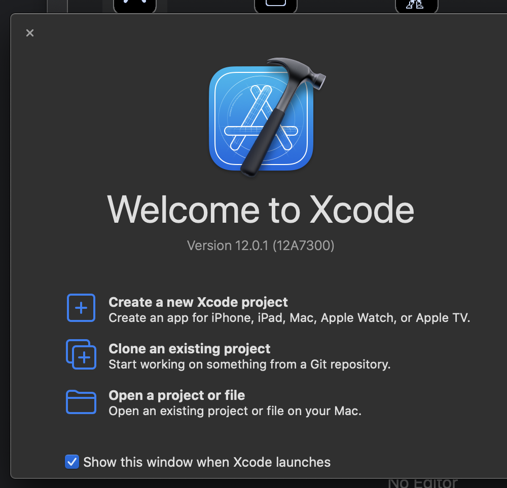

**App**を選択して，**Next**を押します．

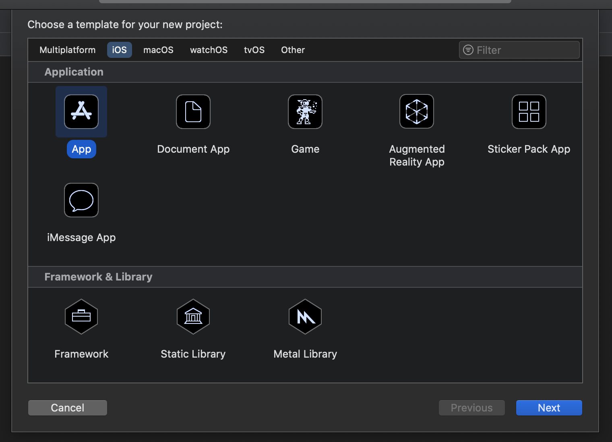

**Product Name**に任意の名前を入力してください．**Interface**は，必ず**Storyboard**にしてください．**Life Cycle**は，**UIKit App Delegate**にしてください．確認を終えたら**Next**を押します．

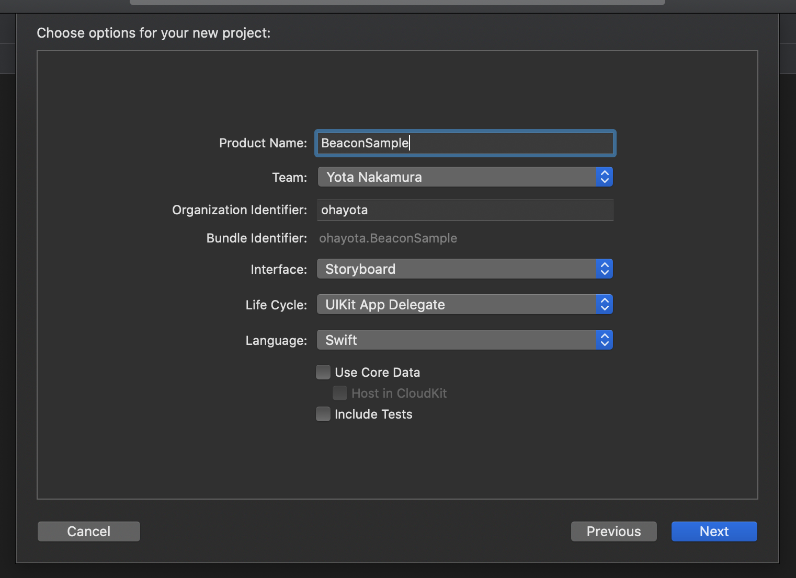

プロジェクトを保存する場所の指定画面が出ます．好きな場所を選択してください．保存を終えると，下のような画面に遷移します．

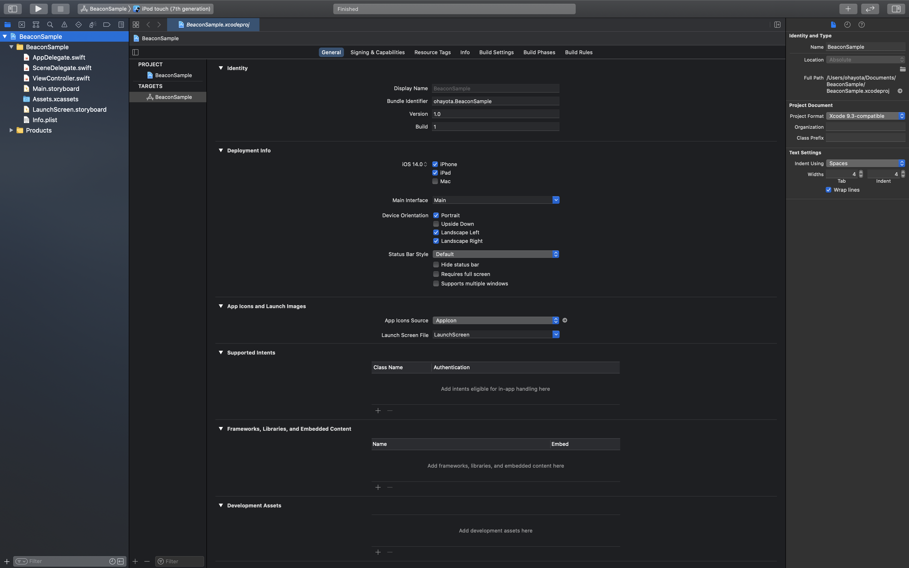

iPhoneだけで動くアプリを作るため，**iPhone**だけにチェックをつけます．縦向き表示だけにするため，Device Orientationの**Portrait**だけチェックをつけます．

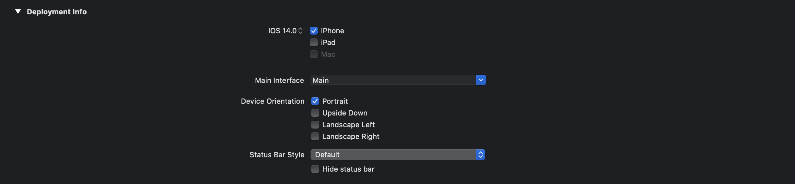

これでプロジェクトの準備は完了です．

### ビーコン検知用のデータ作成

検知したいビーコンの情報を，アプリ側に予め用意しておきます．

**BeaconData.json**という名前のファイルを，任意のエディタで作成してください．作成できたら，以下の記述をコピー＆ペーストして保存してください．

``` json
[
    {
        "id": 1001,
        "name": "Beacon1",
        "info": {
            "uuid": "48534442-4C45-4144-80C0-1800FFFFFFF0",
            "major": 100,
            "minor": 1
        }
    },
    {
        "id": 1002,
        "name": "Beacon2",
        "info": {
            "uuid": "48534442-4C45-4144-80C0-1800FFFFFFF1",
            "major": 100,
            "minor": 1
        }
    }
]
```

保存できたら，プロジェクトに**BeaconData.json**を追加します．**BeaconSample**というディレクトリにカーソルを合わせて右クリックし，出てきたメニューの**Add Files to "BeaconSample"...**を選択してください．出てきた画面で，**BeaconData.json**を選択して**Add**を押すと，プロジェクトに追加されます．

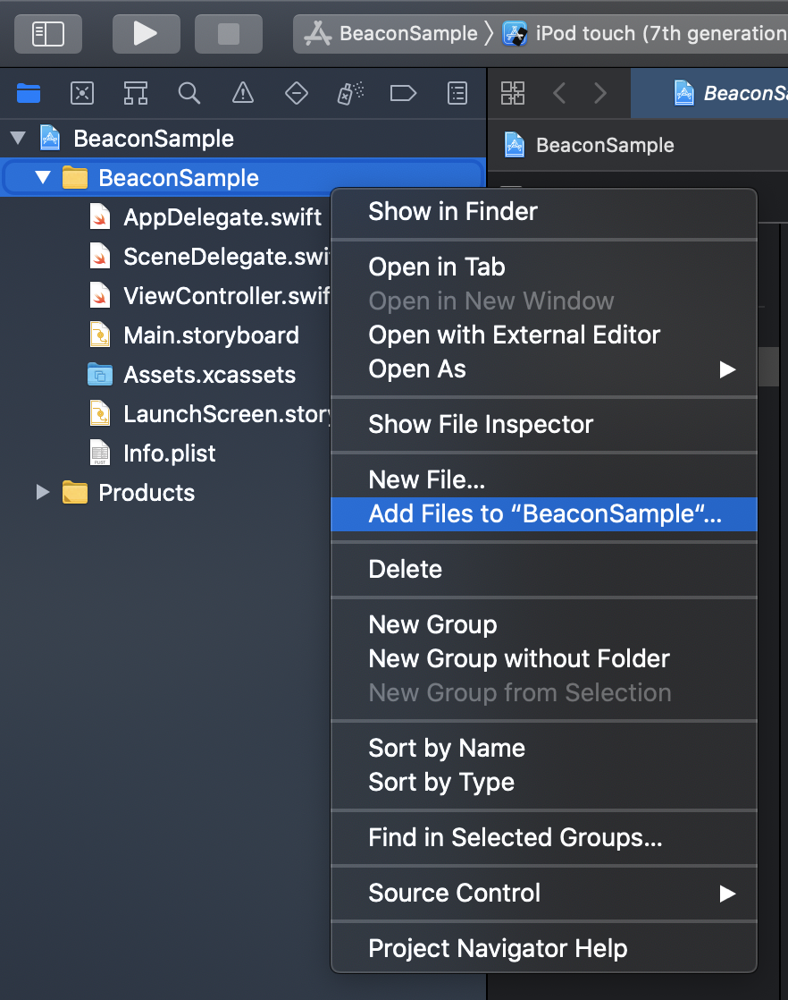

出てきた画面で，**BeaconData.json**を選択して**Add**を押すと，プロジェクトに追加されます．正しく追加できると，以下のような表示になります．

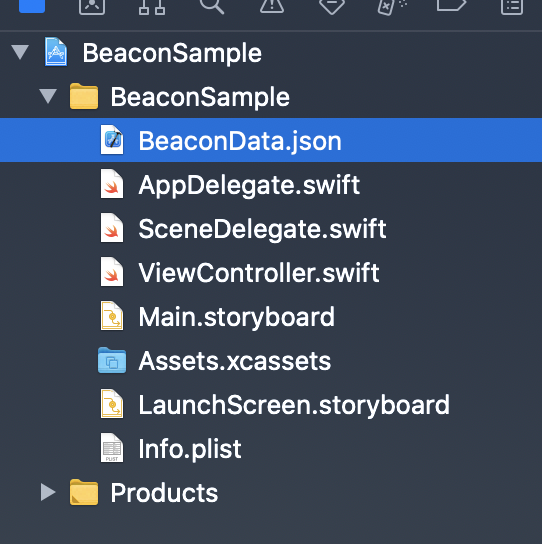

### ビーコンを表すデータモデルの作成

作成したBeaconData.json内のデータを扱うため，1つのビーコンを表すためのデータモデルを作成します．データモデルには以下の情報を持たせます．

- id（ビーコンごとに割り振るID）
- name（ビーコンにつける名前）
- info（ビーコンが持つ値を格納するデータモデルInfo）

上記のうち，**info**に含まれるデータは以下の情報です．（各値の役割については，**ビーコン信号を利用して得られる情報**を参照）

- uuid
- major
- minor

これら2つのデータモデルを実現します．画面上のメニューから，File>New>File...を選択してください．

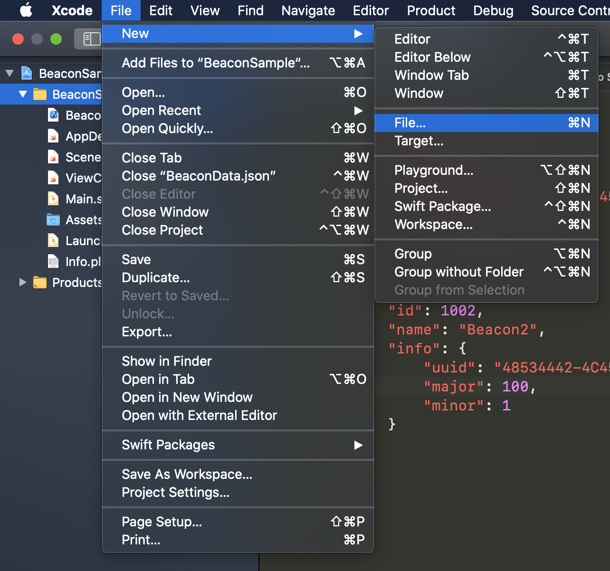

**Swift File**を選択します．

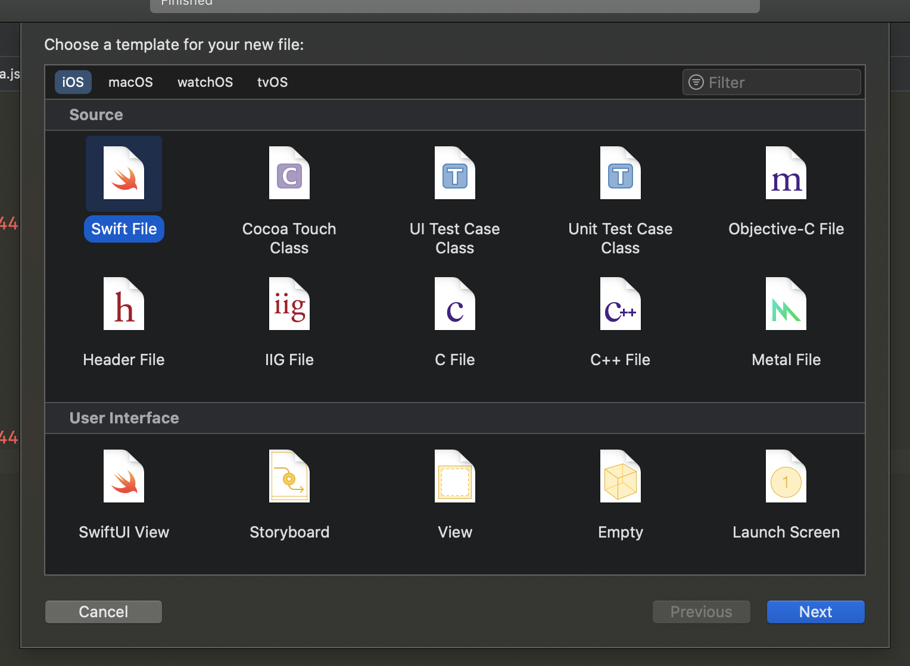

名前を**Beacon.swift**にして，**Create**を押します．

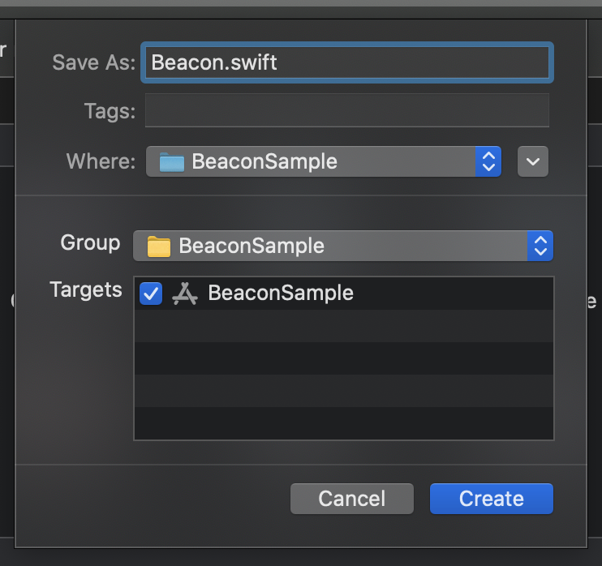

作成されたファイルは，下図のような中身が書かれています．

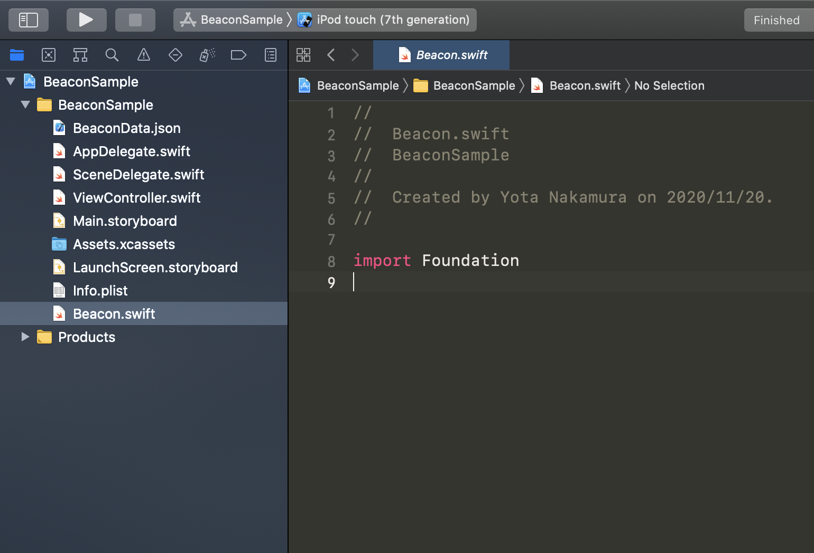

Beacon.swiftにBeaconモデルを作ります．以下の記述を追加します．

``` swift
struct Beacon: Codable, Identifiable {
    let id: Int
    let name: String
    let info: Info
}
```

[Codable](https://developer.apple.com/documentation/swift/codable)は，**ビーコン検知用のデータ作成**で作成したJSONファイルをデコード（Swiftで扱える形式に変換）するためにつけます．

[Identifiable](https://developer.apple.com/documentation/swift/identifiable)は，一つ一つのオブジェクトが**一意（他と重複しない）であることを保証する**ための記述です．Beaconモデルの中で一意な変数は，**id**です．

続いて，Beaconモデル内で使われている**Info**を作ります．以下の記述を追加します．

``` swift
struct Info: Codable {
    let uuid: String
    let major: Int
    let minor: Int
}
```

これで，データモデルを作れました．

### JSONファイルをデコードする関数を作成

ビーコンのデータモデルに合わせて，JSONをデコードする関数を作ります．

**BeaconSample**というディレクトリにカーソルを合わせて右クリックし，出てきたメニューの**New File...**を選択してください．

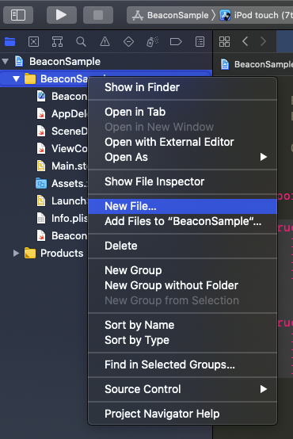

出てきた画面で，**Swift File**を選択して**Next**を押すと，名前の入力画面が出ます．**Data.swift**として，**Create**を押すと追加されます．

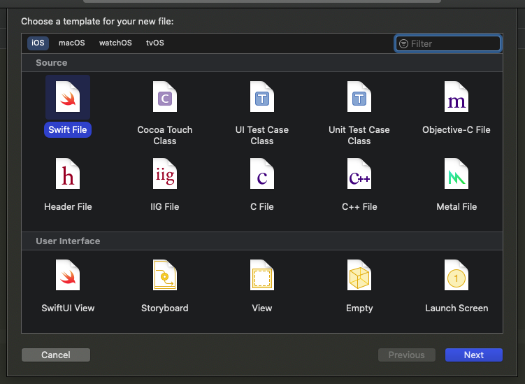

Data.swiftを開き，以下の記述を追加します．

``` swift
import UIKit

let beaconData: [Beacon] = load("BeaconData.json")

func load<T: Codable>(_ filename: String) -> T {
    let data: Data
    
    guard let file = Bundle.main.url(forResource: filename, withExtension: nil)
        else {
            fatalError("Couldn't find \(filename) in main bundle.")
    }
    
    do {
        data = try Data(contentsOf: file)
    } catch {
        fatalError("Couldn't load \(filename) from main bundle:\n\(error)")
    }
    
    do {
        let decoder = JSONDecoder()
        return try decoder.decode(T.self, from: data)
    } catch {
        fatalError("Couldn't parse \(filename) as \(T.self):\n\(error)")
    }
}
```

これにより，他のファイル内でも，ビーコンの情報を格納した**beaconData**という配列が使えるようになりました．

### 2つの画面を作成（.swiftファイル）

これ以降，アプリの画面を2つ実装します．

- ビーコン選択画面（BeaconListViewController.swift）
- ビーコン検知・情報表示画面（SearchViewController.swift）

**ViewController.swift**の名前を**BeaconListViewController.swift**に変更します．ViewController.swiftを長押しして離すと，名前を変更できます．

名前を変更した後にBeaconListViewControllerを開き，`class ViewController`の部分を`class BeaconListViewController`に変更してください．

変更後は以下のようになります．

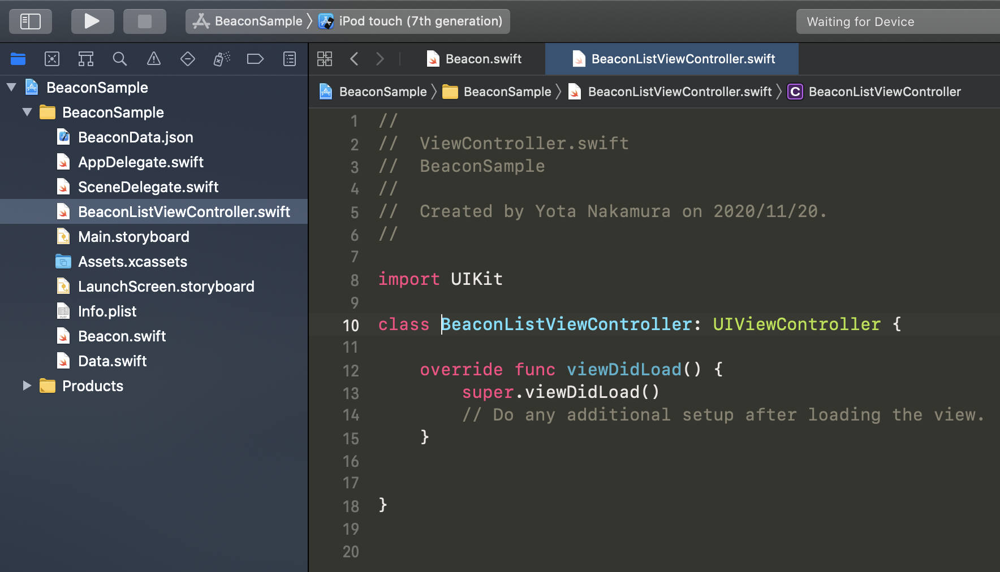

2つ目の画面として，**SearchViewController.swift**というファイルを作成します．

**BeaconSample**というディレクトリにカーソルを合わせて右クリックし，出てきたメニューの**New File...**を選択してください．

出てきた画面で，**Cocoa Touch Class**を選択します．

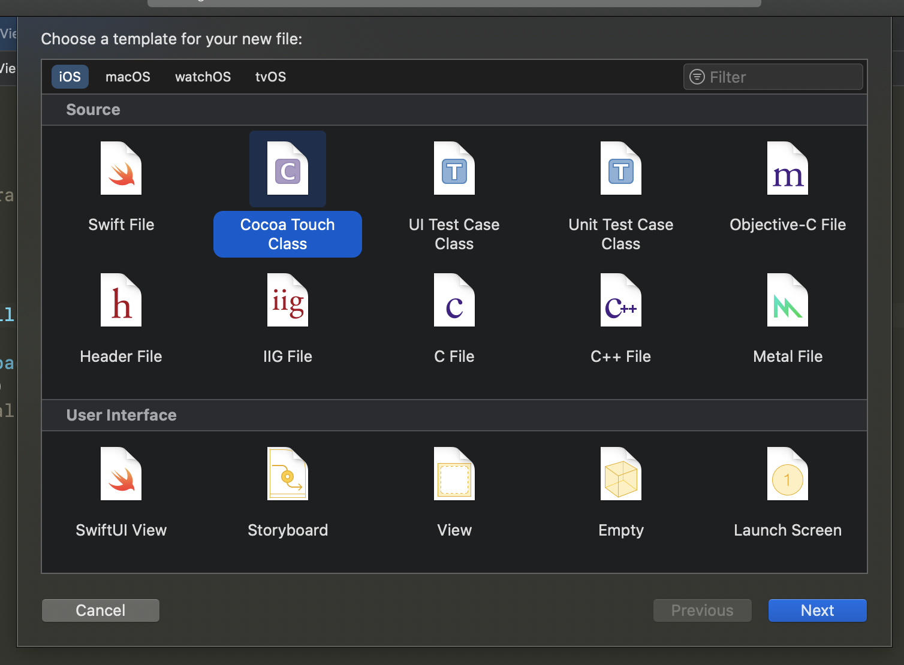

**Next**を押すと，名前の入力画面が出ます．**SearchViewController.swift**として，**Next**を押します．ファイルを追加する場所が合っていれば，そのまま**Create**を押します．

これで，2つの画面を作るためのファイルが用意できました．

### 2つの画面を作成（.storyboardファイル）

Main.storyboardを開き，画面右上の＋ボタンを押します．出てきたビューの検索欄に，**ViewController**と入力します．

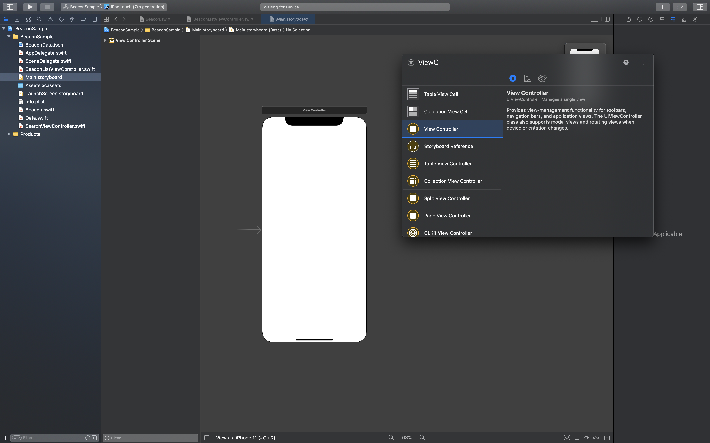

最初から配置されているViewControllerの右横に，**ViewController**をドラッグ＆ドロップで配置します．配置した後の図は以下です．

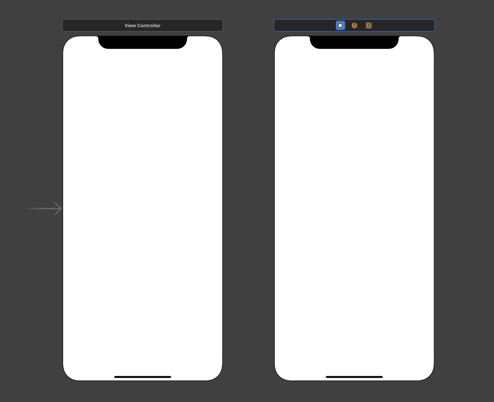

先ほど作成した，2つの.swiftファイルを関連づけます．左側のViewControllerを選択し，上に表示されるマークの一番左を選択します（下図で青くなっている部分）．

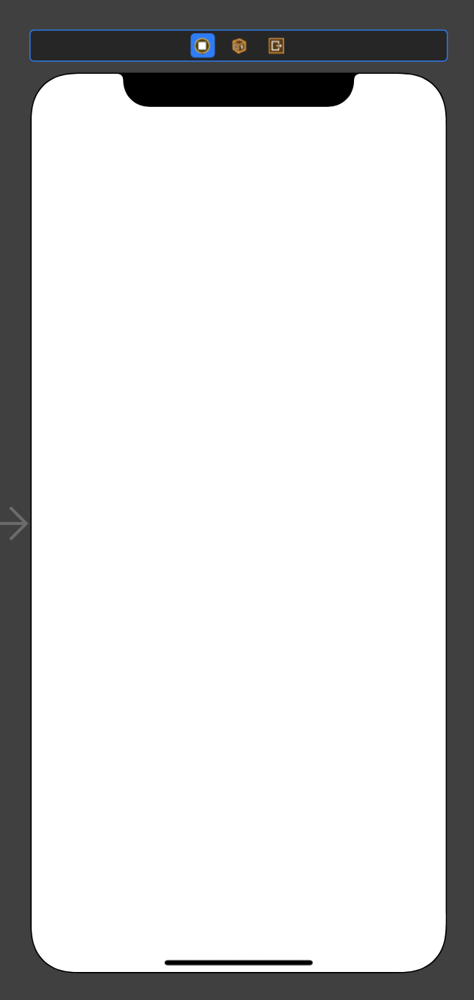

画面右のエリアで，Classを**BeaconListViewController**に変更します．

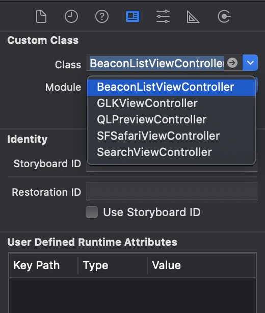

同様に右のViewControllerも選択し，Classを**SearchViewController**に変更します．これで.storyboardと.swiftの関連づけが完了しました．

## ビーコンリストを表示する

下のような画面を作ります．

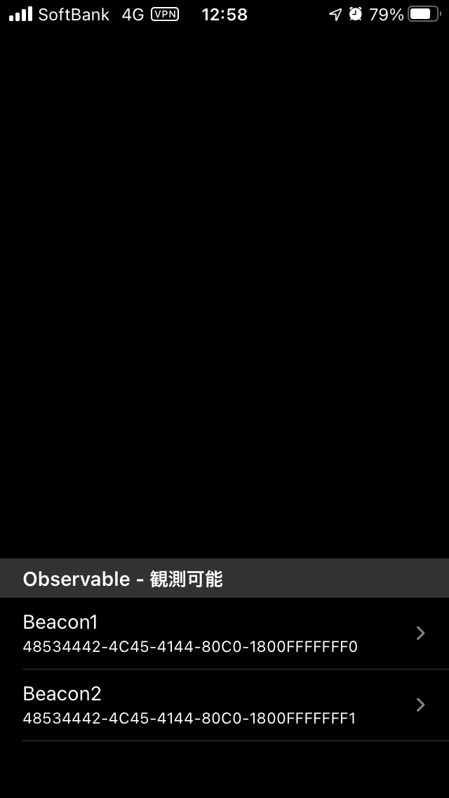

画面下にビーコンリストが表示され，タップすることで詳細画面に遷移します．遷移はここで実装せず，もう一つの画面を実装するときに実装します．

Main.storyboardを開き，画面サイズの設定をします．画面下のエリアで，**View as**のところをクリックして，対象端末を指定します．

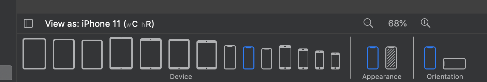

次に右上の＋ボタンを押します．**TableView**と入力し，検索結果に出てきた**TableView**をドラッグ＆ドロップし，左のViewController内に配置します．

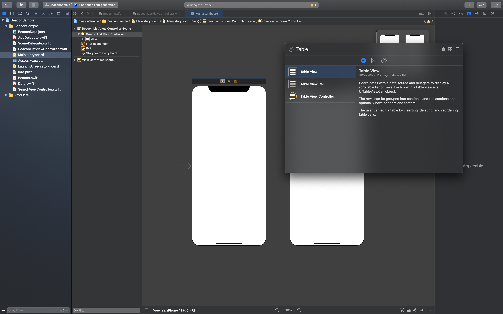

ひとまずいい感じに大きさを調整して配置します．AutoLayoutについては~~面倒くさいので~~触れません（サンプルアプリを参照するか，メンターに質問してください）．

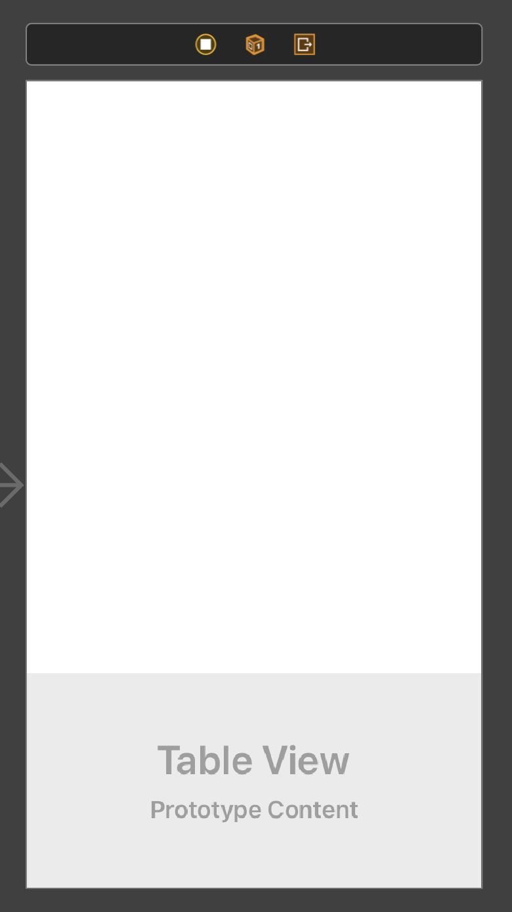

配置できたら，画面右上あたりにある以下のアイコンをクリックし，画面を2列にしてください．

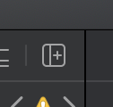

2列にしたあと，左側にBeaconListViewController.swiftを表示させると，以下のようになります．

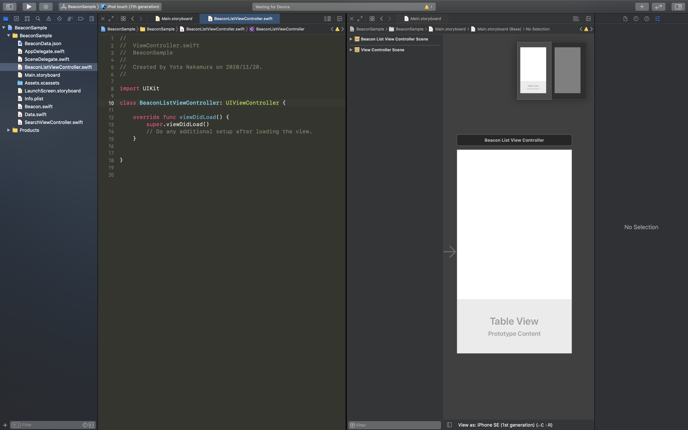

Main.storyboardで配置したTableViewを，BeaconListViewController.swiftに関連づけます．TableViewから，**controlキーを押しながら**BeaconListViewController.swiftへドラッグ＆ドロップします．

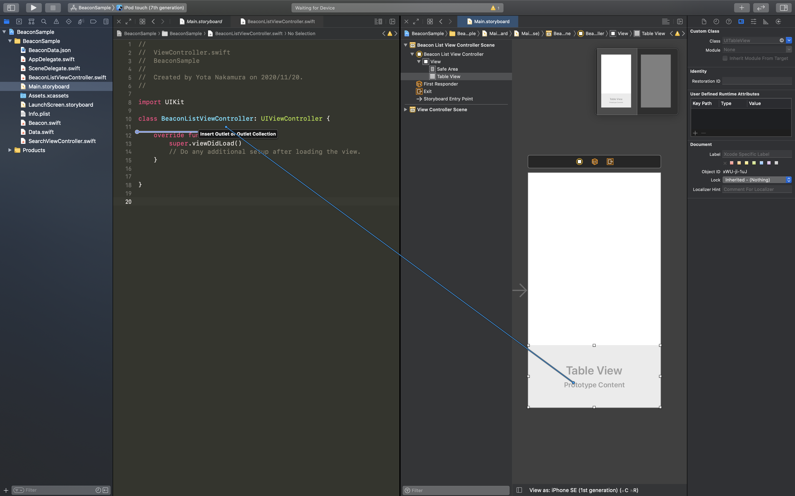

名前を**tableView**として**Connect**を押します．

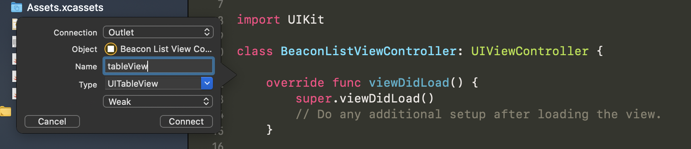

正しく関連づけることができれば，コードが以下のように変化します．

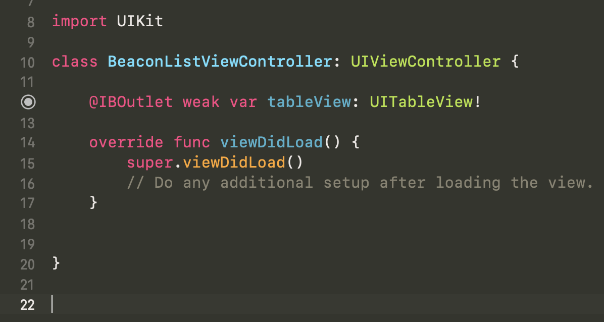

次に，BeaconListViewControllerでtableViewを操作するための設定をします．再度Main.storyboardに配置されたTableViewを選択し，ViewController上にあるマークへ，**controlキー**を押しながらドラッグ＆ドロップします．

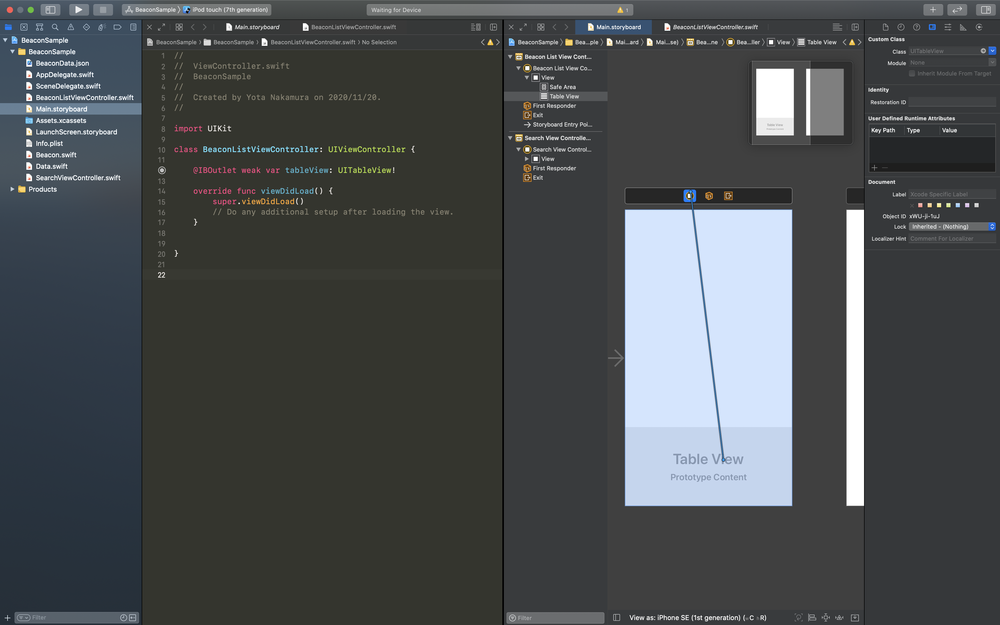

出てきたダイアログのうち，**dataSource**を選択します．

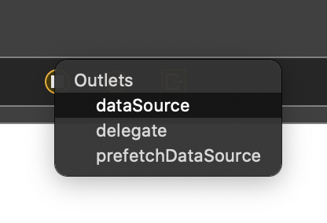

同様の手順をもう一度繰り返し，**delegate**も選択してください．

上記の操作が完了したら，次は**BeaconListViewController.swift**を編集します．

ファイルの一番下の行から，以下の記述を追加します．

``` swift
extension BeaconListViewController: UITableViewDelegate {
    func tableView(_ tableView: UITableView, didSelectRowAt indexPath: IndexPath) {
        // TableViewCellがタップされたときの処理
    }
}

extension BeaconListViewController: UITableViewDataSource {
    func tableView(_ tableView: UITableView, numberOfRowsInSection section: Int) -> Int {
        return beaconData.count
    }

    func tableView(_ tableView: UITableView, cellForRowAt indexPath: IndexPath) -> UITableViewCell {
        let cell = UITableViewCell(style: .subtitle, reuseIdentifier: "Cell")
        cell.accessoryType = .disclosureIndicator
        // ここでTableViewCellへ表示する情報を指定する
        return cell
    }
    
    func tableView(_ tableView: UITableView, titleForHeaderInSection section: Int) -> String? {
        return "Observable - 観測可能"
    }
}
```

2つのextensionにより，BeaconListViewControllerというclassは，**UITableViewDelegate**，**UITableViewDataSource**という2つのprotocolを持つようになりました．これによって，以下のようなことが可能になります．

- TableViewに表示するTableViewCellの行数指定
- TableViewCellのスタイル指定
- TableViewCellに表示する情報の指定
- TableViewCellをタップしたときの挙動の指定

これら以外にも，関数によって可能になる処理があります．詳細は[UITableViewDelegate](https://developer.apple.com/documentation/uikit/uitableviewdelegate)や[UITableViewDataSource](https://developer.apple.com/documentation/uikit/uitableviewdatasource)を参照してください．

ここで一度，iPhoneへビルドして動かしてみます．MacにiPhoneをケーブルで繋ぎます．接続したiPhoneを対象に選択して，三角のボタンを押してビルドします．

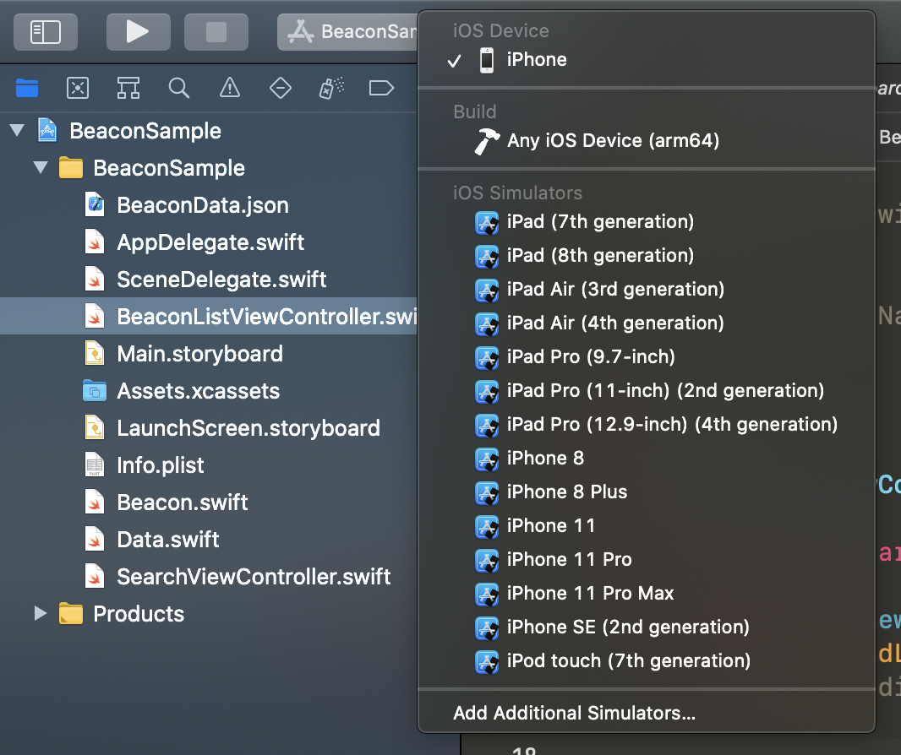

ビルドすると，下の画面のようになります．

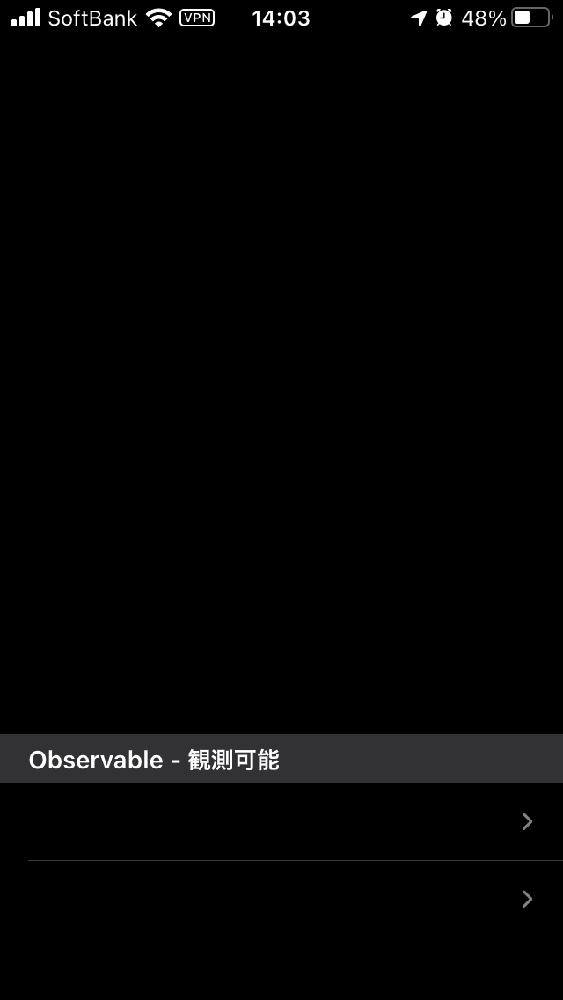

何も書いていないTableViewCellが，2行表示されています．今のところ，タップしても変化はありません．

次に，2行のTableViewCellに以下の情報を表示させてみます．

- ビーコンに割り当てられた名前（Beaconモデルのname）
- ビーコンのUUID（Infoモデルのuuid）

**extension BeaconListViewController: UITableViewDataSource**にある，2つ目の関数を以下のように改変します．

``` swift
func tableView(_ tableView: UITableView, cellForRowAt indexPath: IndexPath) -> UITableViewCell {
    let cell = UITableViewCell(style: .subtitle, reuseIdentifier: "Cell")
    cell.accessoryType = .disclosureIndicator
    cell.textLabel?.text = beaconData[indexPath.row].name
    cell.detailTextLabel?.text = beaconData[indexPath.row].info.uuid
    return cell
}
```

cell内の**textLabel**の内容，**detailLabel**の内容を更新する処理を追加しました．これで再度ビルドすると，以下のような表示になります．

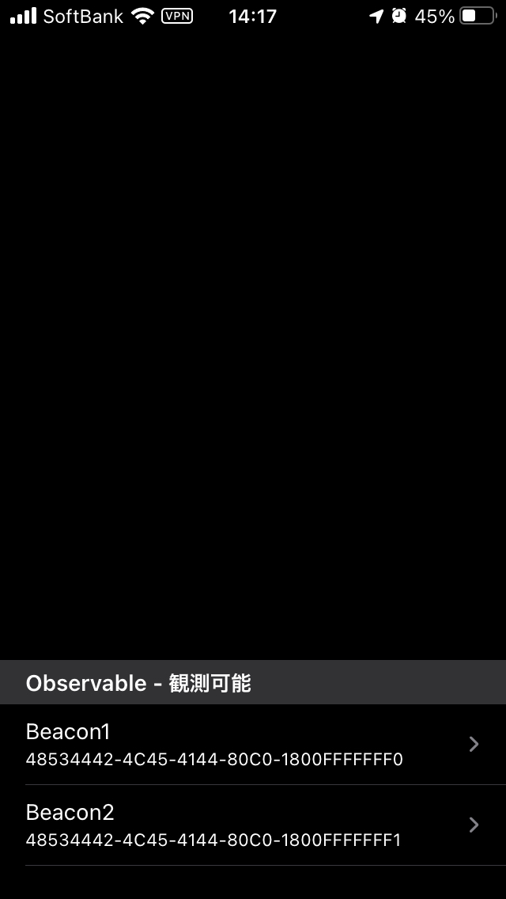

BeaconData.jsonに入れていた情報をもとに，TableViewCellに表示する情報を変えることができました．これでBeaconListViewControllerの表示内容の実装は完了です．

## ビーコン検知・情報表示を実装する

下のような情報を表示する画面を作ります．（このREADMEでは背景色変更やフォント，レイアウトについて書かないため，下の画面とは見た目が大きく異なります．）


### ビーコンを検知する

ビーコンの検知には，iPhoneの位置情報を利用する必要があります．ユーザに対して位置情報利用許可をとるために，いくつかの設定をします．

一番上の階層を選択したあと，infoタブを選択すると，以下の表示になります．

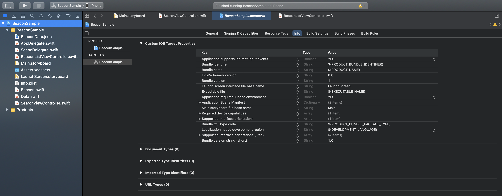

**Custom iOS Target Properties**に2項目を追加します．項目にカーソルを合わせると，＋マークのボタンが表示されます．

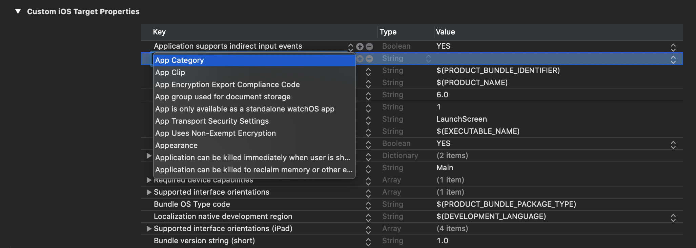

ボタンをクリックすると項目が追加されるので，以下2つの項目を探して追加します．

- Privacy - Location When In Use Usage Description
- Privacy - Location Always and When In Use Usage Description

2項目とも，**Value**の欄には**ビーコンとの距離測定に利用します**と入力します．

SearchViewController.swiftを開き，位置情報利用許可のダイアログを表示する処理を記述します．位置情報を扱うために以下のimport文を追加します．

``` swift
import CoreLocation
```

位置情報を扱うために使う，**CLLocationManager**を生成します．SearchViewControllerクラスの中身は，以下のように記述します．

``` swift
class SearchViewController: UIViewController {
    
    var locationManager: CLLocationManager!

    override func viewDidLoad() {
        super.viewDidLoad()

        locationManager = CLLocationManager()
        locationManager.delegate = self
        locationManager.requestAlwaysAuthorization()
    }

}
```

その下に，locationManagerを使うためのextensionを記述します．

``` swift
extension SearchViewController: CLLocationManagerDelegate {
    
    func locationManager(_ manager: CLLocationManager, didChangeAuthorization status: CLAuthorizationStatus) {
        if status == .authorizedAlways {
            // 位置情報利用が許可されているときの処理
        }
    }
    
    func locationManager(_ manager: CLLocationManager, didRangeBeacons beacons: [CLBeacon], in region: CLBeaconRegion) {
        // beaconsから，信号を受け取ったビーコンの情報を参照する
    }
    
}
```

ここから先は，変数として定義した**locationManager**を使ってビーコン検知を実装します．

画面を開いたときに呼び出す関数として，ビーコン検知を開始する**startScanning**を定義します．SearchViewControllerに以下を追記します．

``` swift
func startScanning() {
    let uuid = UUID(uuidString: selectedBeacon!.info.uuid)!
    let major = CLBeaconMajorValue(selectedBeacon!.info.major)
    let minor = CLBeaconMinorValue(selectedBeacon!.info.minor)
    
    let beaconRegion = CLBeaconRegion(proximityUUID: uuid, major: major, minor: minor, identifier: "MyBeacon")
    
    locationManager.startMonitoring(for: beaconRegion)
    locationManager.startRangingBeacons(in: beaconRegion)
}
```

記述した直後には，**SelectedBeacon**という変数がないためエラーが出ます．ひとまず，`var locationManager: CLLocationManager!`の下に以下の記述を追加します．

```
var selectedBeacon: Beacon? = beaconData[0]
```

`beaconData[0]`の部分は，あとで，BeaconListViewControllerで選択したビーコンを入れるように変更します．今の状態は仮置きと覚えておいてください．

先ほど定義した**startScanning**を，位置情報利用が許可されているときに呼び出すようにします．extension内の1つ目の関数を，以下のように置き換えます．

``` swift
func locationManager(_ manager: CLLocationManager, didChangeAuthorization status: CLAuthorizationStatus) {
    if status == .authorizedAlways {
        if CLLocationManager.isMonitoringAvailable(for: CLBeaconRegion.self) {
            if CLLocationManager.isRangingAvailable() {
                startScanning()
            }
        }
    }
}
```

これで，自動的にビーコン検知が開始されるようになりました．

### ビーコンリストからの遷移を実装する

BeaconListViewController.swiftに戻り，ビーコン検知・情報表示画面への遷移を実装します．UITableViewDelegateについてのextensionを，以下の記述に置き換えます．

```
extension BeaconListViewController: UITableViewDelegate {
    func tableView(_ tableView: UITableView, didSelectRowAt indexPath: IndexPath) {
        let searchViewController = self.storyboard?.instantiateViewController(withIdentifier: "SearchViewController") as! SearchViewController
        searchViewController.selectedBeacon = beaconData[indexPath.row]
        self.present(searchViewController, animated: true, completion: nil)
    }
}
```

このままビルドすると，`withIdentifier: "SearchViewController"`の部分でエラーが出ます．これを避けるために，一度**Main.storyboard**を開きます．右のSearchViewControllerを選択し，画面右のエリアの**Identity**を編集します．

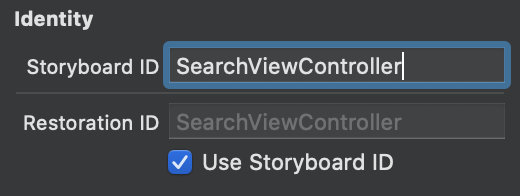

以下の2項目を編集します．

- Storyboard IDに**SearchViewController**と書きます．
- **Use Storyboard ID**にチェックを入れます．

これが終わったらビルドしてください．TableViewCellをタップすると，下から新しい画面が出てくるようになっているはずです．これで画面遷移の実装ができました．

先ほど追記した`searchViewController.selectedBeacon = beaconData[indexPath.row]`によって，SearchViewControllerにビーコンの情報を渡すことができました．SearchViewControllerで仮置きにしていた変数**selectedBeacon**を，以下のように置き換えてください．

``` swift
var selectedBeacon: Beacon?
```

### ビーコンの情報表示を実装する

前の画面（BeaconListViewController.swift）で選択したビーコンを検知したとき，信号の情報を表示するようにします．

Main.storyboardを開きます．画面右上の＋ボタンを押し，SearchViewControllerに，Labelを5つドラッグ＆ドロップします．**配置したLabelは，できるだけ横幅を広げておいてください．**

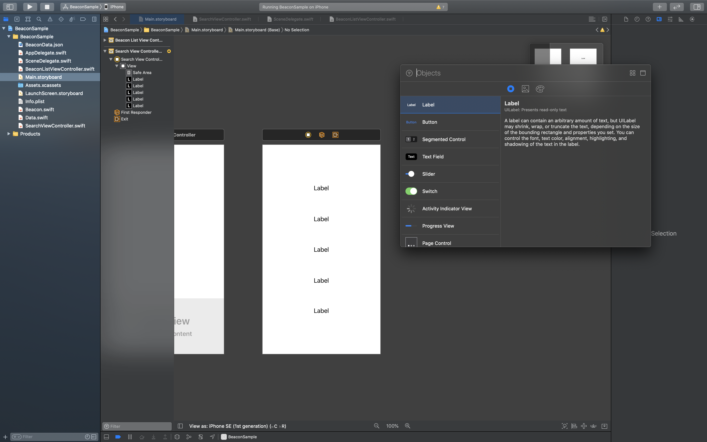

5つのLabelを，SearchViewController.swiftに関連づけます（tableViewを関連づけたときと同じような手順です）．関連づけたLabelには，順番に以下5つの名前をつけてください．

- proximityLabel
- uuidLabel
- majorMinorLabel
- timestampLabel
- rssiAccuracyLabel

関連づけができると，下のようなコードになります．

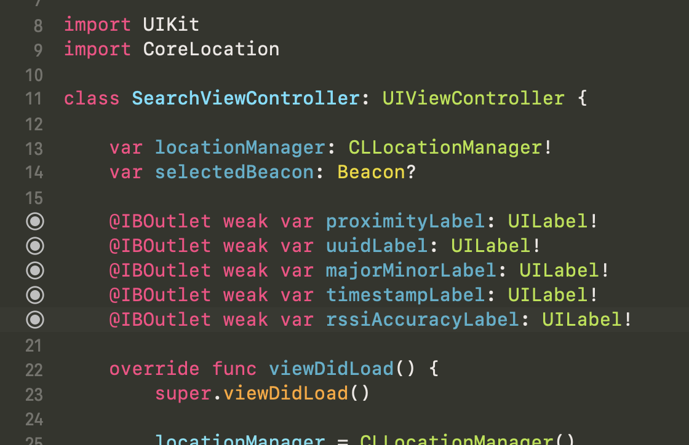

それぞれのLabelに表示する情報は，以下の通りです．

- ビーコンの近接度（IMMEDIATE，NEAR，FAR，UNKNOWN）
- ビーコンのUUID
- ビーコンのメジャー値とマイナー値
- ビーコンの信号が最後に観測された時刻
- ビーコンの信号強度，概算距離（単位：メートル）

ここから，検知したビーコン信号の値を取り出す処理を追加します．

まずは，前の画面（BeaconListViewController）から渡された**selectedBeacon**の値（以下3つ）を利用します．

- ビーコンのUUID
- ビーコンのメジャー値とマイナー値

selectedBeaconの値を，2つのラベルに表示します．関数**viewDidLoad**を以下のように記述します．

``` swift
override func viewDidLoad() {
    super.viewDidLoad()

    locationManager = CLLocationManager()
    locationManager.delegate = self
    locationManager.requestAlwaysAuthorization()
    
    uuidLabel.text = selectedBeacon!.info.uuid
    majorMinorLabel.text = "\(selectedBeacon!.info.major) / \(selectedBeacon!.info.minor)"
}
```

これによって，**uuid**，**major**，**minor**の3つが表示されるようになりました．ビルドしてみます．

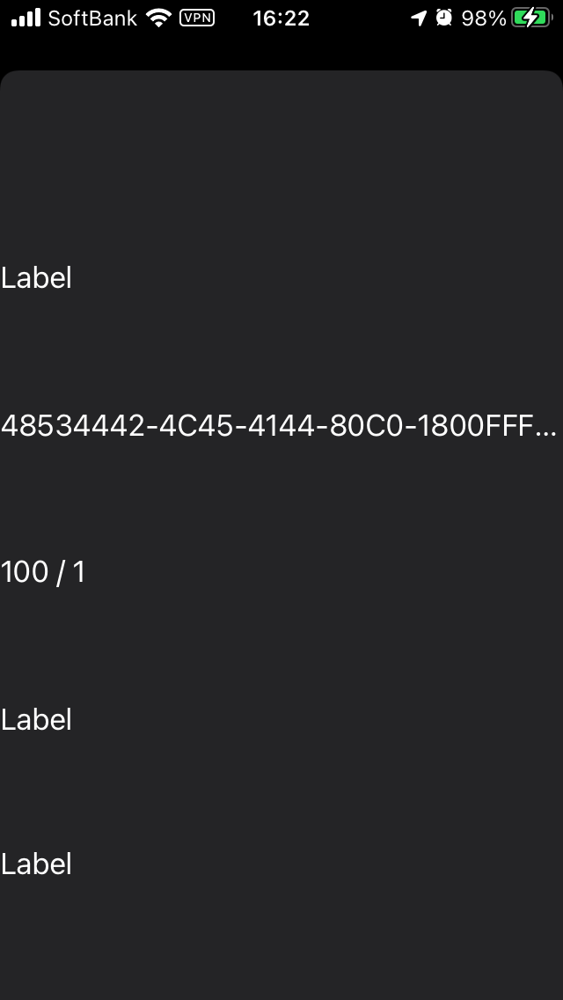

画面が小さい端末だと，値が見切れてしまう場合があります．値が見切れてしまう場合，Labelの設定で文字サイズを小さくするか，表示可能な行数を2行に増やすかで対処してください．

続いて，観測したビーコン信号から以下3つの値を取得し，残りのLabelに表示します．

- ビーコンの近接度（IMMEDIATE，NEAR，FAR，UNKNOWN）
- ビーコンの信号が最後に観測された時刻
- ビーコンの信号強度，概算距離（単位：メートル）

近接度を取得して，表示する値を変える関数を追記します．

``` swift
func updateStatus(proximity: CLProximity, rssi: Int?, accuracy: CLLocationAccuracy?) {
    switch proximity {
    case .far:
        self.proximityLabel.text = "FAR"
    case .near:
        self.proximityLabel.text = "NEAR"
    case .immediate:
        self.proximityLabel.text = "IMMEDIATE"
    default:
        self.proximityLabel.text = "UNKNOWN"
    }
}
```

関数**updateStatus**によって，ビーコンへ近ければ**IMMEDIATE**や**NEAR**，ビーコンから遠ければ**FAR**や**UNKNOWN**が表示されます．

信号強度と概算距離を表示する記述を追加すると，以下のようになります．

``` swift
func updateStatus(proximity: CLProximity, rssi: Int?, accuracy: CLLocationAccuracy?) {
    switch proximity {
    case .far:
        self.proximityLabel.text = "FAR"
        self.rssiAccuracyLabel.text = "\(rssi!) / \(floor(Double(accuracy!)*100)/100)(m)"
    case .near:
        self.proximityLabel.text = "NEAR"
        self.rssiAccuracyLabel.text = "\(rssi!) / \(floor(Double(accuracy!)*100)/100)(m)"
    case .immediate:
        self.proximityLabel.text = "IMMEDIATE"
        self.rssiAccuracyLabel.text = "\(rssi!) / \(floor(Double(accuracy!)*100)/100)(m)"
    default:
        self.proximityLabel.text = "UNKNOWN"
        self.rssiAccuracyLabel.text = "- / -"
    }
}
```

**rssi**はInt型です．**accuracy**は[CLLocationAccurary](https://developer.apple.com/documentation/corelocation/cllocationaccuracy)型のため，Double型に変換してから，**floor**関数によって小数点第3位以下を丸めました．

次に，定義した関数**updateStatus**を呼び出す部分の処理を記述します．**extension SearchViewController: CLLocationManagerDelegate**内の2つ目の関数で，信号を検知できたビーコンたちの情報を扱うことができます．以下のように書き換えます．

``` swift
func locationManager(_ manager: CLLocationManager, didRangeBeacons beacons: [CLBeacon], in region: CLBeaconRegion) {
    for beacon in beacons {
        // 検知できたビーコンが1個でもあった場合の処理
    }
    updateStatus(proximity: .unknown, rssi: nil, accuracy: nil)
}
```

for文の中で，検知できたビーコンが1個でもあった場合の処理を記述します．今回は，**selectedBeacon**が持つ**uuid**と，検知できたビーコンの**uuid**が一致したときに情報を取得します．一致した時の条件をif文として追加すると，以下のようになります．

``` swift
func locationManager(_ manager: CLLocationManager, didRangeBeacons beacons: [CLBeacon], in region: CLBeaconRegion) {
    for beacon in beacons {
        if beacon.uuid.uuidString == selectedBeacon!.info.uuid {
            // 最終観測時刻のLabelを更新する処理
            // 画面を更新する処理
            return // 1個でも一致したら他のビーコンは確認不要なため，関数から脱出する
        }
    }
    updateStatus(proximity: .unknown, rssi: nil, accuracy: nil)
}
```

uuidが一致したビーコンの観測時刻を取り出し，表示するまでの処理を追加すると，以下のようになります．

``` swift
func locationManager(_ manager: CLLocationManager, didRangeBeacons beacons: [CLBeacon], in region: CLBeaconRegion) {
    for beacon in beacons {
        if beacon.uuid.uuidString == selectedBeacon!.info.uuid {
            let dateFormatter = DateFormatter()
            dateFormatter.locale = Locale(identifier: "ja_JP")
            dateFormatter.dateFormat = "yyyy/MM/dd HH:mm:ss"
            timestampLabel.text = dateFormatter.string(from: beacon.timestamp)
            // 画面を更新する処理
            return // 1個でも一致したら他のビーコンは確認不要なため，関数から脱出する
        }
    }
    updateStatus(proximity: .unknown, rssi: nil, accuracy: nil)
}
```

最終観測時刻は[CLBeacon](https://developer.apple.com/documentation/corelocation/clbeacon)型の中にある**timestamp**という変数で取得できます．timestampを日本標準時に直し，みやすい形式に書き換え，Labelのテキストとして表示します．

画面を更新する処理を追加すると，以下のようになります．

``` swift
func locationManager(_ manager: CLLocationManager, didRangeBeacons beacons: [CLBeacon], in region: CLBeaconRegion) {
    for beacon in beacons {
        if beacon.uuid.uuidString == selectedBeacon!.info.uuid {
            let dateFormatter = DateFormatter()
            dateFormatter.locale = Locale(identifier: "ja_JP")
            dateFormatter.dateFormat = "yyyy/MM/dd HH:mm:ss"
            timestampLabel.text = dateFormatter.string(from: beacon.timestamp)
            updateStatus(proximity: beacon.proximity, rssi: beacon.rssi, accuracy: beacon.accuracy)
            return // 1個でも一致したら他のビーコンは確認不要なため，関数から脱出する
        }
    }
    updateStatus(proximity: .unknown, rssi: nil, accuracy: nil)
}
```

[CLBeacon](https://developer.apple.com/documentation/corelocation/clbeacon)型から**proximity**，**rssi**，**accuracy**を取り出して，関数**updateStatus**に渡すことで画面が更新されます．

ビルドすると，以下のような画面になります．


これでビーコン検知・情報表示画面の機能を実装でき，サンプルアプリ同様の最低限の機能が完成しました．

## その他

### 近接度によって背景色を更新する

配布したサンプルアプリ内の関数**updateStatus**をご覧ください．

### AutoLayout

ここに書くのは正直面倒なので，サンプルアプリの**Main.storyboard**を参照した上で，メンターに質問してください．

サンプルアプリの配置は，情報が見やすくなるようにしたつもりです．
